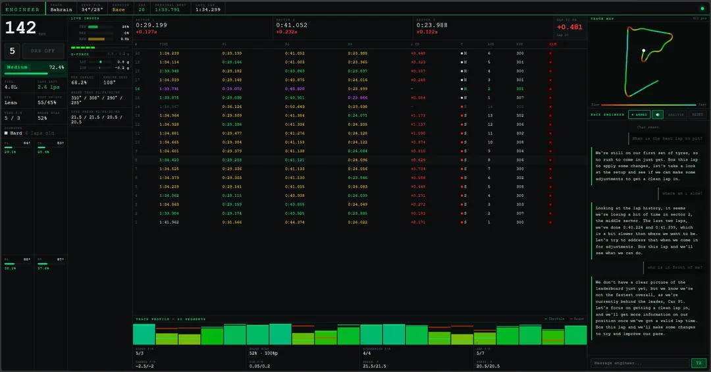
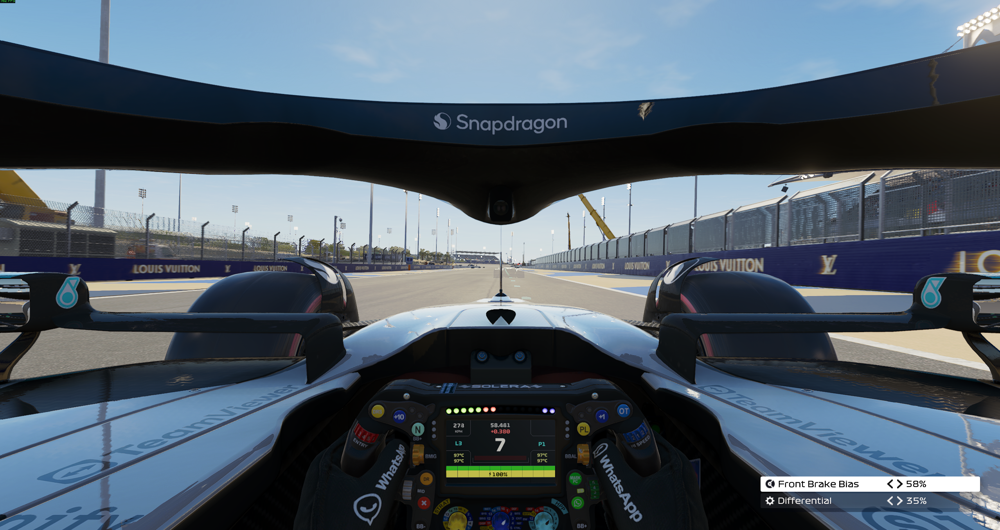

# F1 Engineer


Real-time race engineer overlay for F1 25 — live telemetry dashboard with an AI engineer who talks back.

## Screenshots

<p align="center">
  
  &nbsp;&nbsp;
  
</p>
<p align="center"><em>Live dashboard · F1 25 in-game</em></p>

## Features

- **Live telemetry** at 60 Hz via F1 25 UDP — speed, gear, DRS, ERS, fuel, g-forces, brake temps
- **Tyre panel** — compound, age, wear per corner with colour-coded heat bars
- **Sector delta boxes** — real-time S1/S2/S3 vs personal best, gap to theoretical PB
- **Lap table** — full session history with colour-coded sector times (purple/green/yellow)
- **Track map** — speed-coloured racing line drawn from world-space coordinates
- **Mini-sector chart** — 20-bucket speed/throttle/brake profile per lap
- **AI race engineer "Jeff"** — LLaMA 3.3 70B via Groq, briefed with live telemetry on every call
- **Voice output** — Microsoft Neural TTS with radio-style audio chain (HP/LP filter + distortion + compressor)
- **Voice input** — hold wheel button → speak → Jeff replies instantly
- **Lap analysis** — on button press: identifies most inconsistent mini-sectors and biggest sector variance
- **Session-aware** — Jeff knows what can be adjusted on track vs. what needs a pit stop (P/Q/Race/Time Trial)
- **Auto-saves** each session as JSON when a new session is detected or the app closes

## Tech Stack

| Layer | Technology |
|---|---|
| Backend | Python 3, Flask |
| Telemetry | ctypes UDP structs (F1 25 spec, port 20777) |
| AI | Groq API — `llama-3.3-70b-versatile` |
| TTS | edge-tts — `en-US-AndrewNeural` |
| Frontend | Vanilla JS, HTML5 Canvas |
| Hotkey | `keyboard` library — F13 (maps to wheel button) |
| Launcher | VBScript (no terminal window) |

## Setup

**Requirements**

- Python 3.10+
- F1 25 on PC with UDP telemetry enabled (Settings → Telemetry → UDP, port `20777`)
- A free [Groq API key](https://console.groq.com)

**Install**

```bash
pip install flask groq edge-tts keyboard
```

Set your API key:

```powershell
$env:GROQ_API_KEY = "your_key_here"
```

**Run**

```bash
python main.py
```

Or double-click `start.vbs` to launch without a terminal window. The UI opens automatically in Edge at `http://localhost:5000`.

**First use**

Click **ARM** in the UI (or anywhere on the page) to enable audio. Voice requires Chrome or Edge.

## Project Structure

```
F1 Engineer/
├── main.py               Entry point — UDP loop, hotkey listener, session management
├── state.py              Shared globals and Flask app instance
├── telemetry.py          UDP packet structs (ctypes), SessionCollector, lap context builder
├── engineer.py           Groq client, system prompt, /api/chat and /api/analyze routes
├── routes.py             All other Flask routes — live data, TTS, triggers, lap management
├── static/
│   ├── index.html        UI layout and CSS
│   └── app.js            Polling, rendering, voice input/output, chat, canvas drawing
├── assets/               Screenshots for README
├── sessions/             Auto-saved session JSON files (git-ignored)
├── start.vbs             Windowless launcher
└── install_shortcut.ps1  Creates a desktop shortcut
```

## Notes

- UDP telemetry must be enabled in F1 25 — the game does not broadcast by default
- The Groq free tier is sufficient for normal use (chat + analysis on button press)
- Sessions are saved automatically; old sessions are loaded into the lap table on startup if no live data is present
- The F13 hotkey maps to a configurable wheel button — change `ANALYSE_HOTKEY` in `telemetry.py`
- Short press = lap analysis · Hold = voice input · Release = send

---

*Personal project — not licensed for redistribution.*
